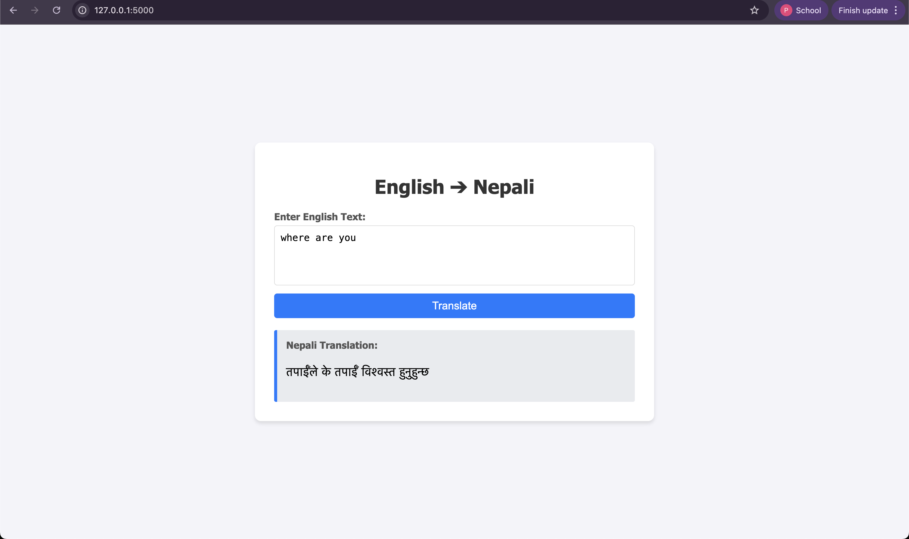

# A3: Building an English → Nepali Machine Translation System

## Task 1: Dataset Preparation

### 1.1 Dataset Source

This project uses an **English-to-Nepali** translation dataset from Hugging Face: `CohleM/english-to-nepali`.

* **Source language:** English
* **Target language:** Nepali
* **Dataset size:** 10,000 sentence pairs were selected to keep training efficient while maintaining quality.

### 1.2 Data Preprocessing

Several preprocessing steps were applied before training:

* **Tokenization:**

  * English sentences were split using whitespace.
  * Nepali sentences were also tokenized using whitespace for simplicity.
* **Normalization:**

  * All text was converted to lowercase to reduce vocabulary size.
* **Vocabulary Creation:**

  * A custom `SimpleVocab` class was used to convert words into numerical indices.
  * The following special tokens were included:

    * `<unk>` (unknown word)
    * `<pad>` (padding)
    * `<sos>` (start of sentence)
    * `<eos>` (end of sentence)
* **Libraries Used:**

  * PyTorch
  * Hugging Face `datasets`
  * Python `collections.Counter`

---

## Task 2: Attention Mechanisms

Two attention mechanisms were implemented to study their effect on translation performance.

### 1. General Attention

General attention measures how well the decoder’s current hidden state matches each encoder output using a learnable weight matrix.

* **Formula:**
  [
  e_i = s^T W h_i
  ]

### 2. Additive Attention

Additive attention combines the decoder hidden state and encoder outputs, then applies a non-linear transformation before computing alignment scores.

* **Formula:**
  [
  e_i = v^T \tanh(W_1 h_i + W_2 s)
  ]

---

## Task 3: Evaluation and Results

### 3.1 Performance Comparison

| Attention Type     | Train Loss | Train PPL | Val Loss  | Val PPL    | Avg Time / Epoch |
| ------------------ | ---------- | --------- | --------- | ---------- | ---------------- |
| General Attention  | 5.156      | 173.44    | 6.088     | 440.36     | ~574 s           |
| Additive Attention | **3.935**  | **51.15** | **5.866** | **352.75** | ~728 s           |

### 3.2 Result Analysis

* **Translation Quality:**
  Additive Attention performed better than General Attention on both training and validation data.
* **Perplexity:**
  Lower perplexity values indicate better language modeling, and Additive Attention achieved significantly lower values.
* **Training Speed:**
  General Attention trained faster due to simpler computations.
* **Overall Observation:**
  Additive Attention captured English–Nepali word relationships more effectively.

### 3.3 Attention Visualization

Attention maps were created to observe how the model aligns English words with Nepali words during translation.
These visualizations show meaningful alignments, such as focusing on question words like *“how”* when generating Nepali questions.

---

## Task 4: Machine Translation Web Application

A simple **Flask-based web application** was built to demonstrate the trained model.

### 4.1 Application Features

1. A text input box for English sentences
2. Translation using the **Additive Attention** model
3. Instant display of the translated Nepali sentence

### 4.2 Application Preview



### 4.3 How to Run the Application

1. Move to the `/app` directory
2. Install dependencies:

   ```bash
   pip install flask torch
   ```
3. Start the application:

   ```bash
   python app.py
   ```
4. Open a browser and go to:

   ```
   http://127.0.0.1:5000
   ```

### 4.4 Model–Application Interface

The web application interacts with the model in the following way:

* Takes an English sentence from the user
* Tokenizes and encodes it using `en_vocab.pt`
* Passes the encoded input through the Encoder
* Uses a greedy decoding process with the Decoder
* Converts predicted indices back to Nepali text using `ne_vocab.pt`